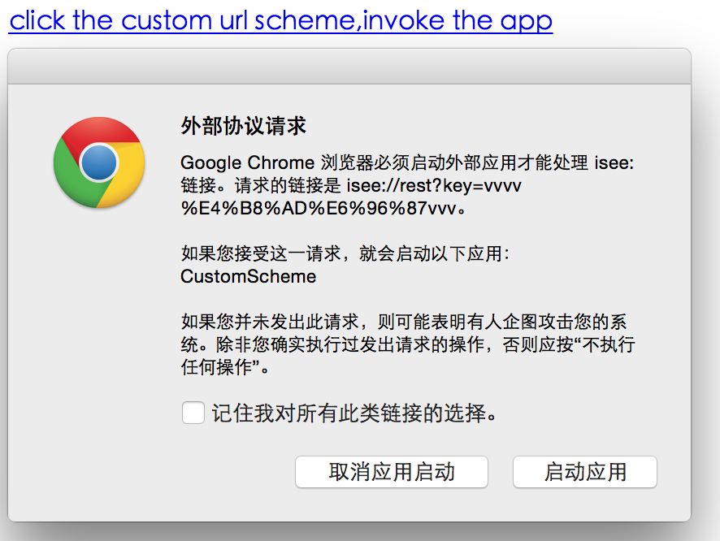
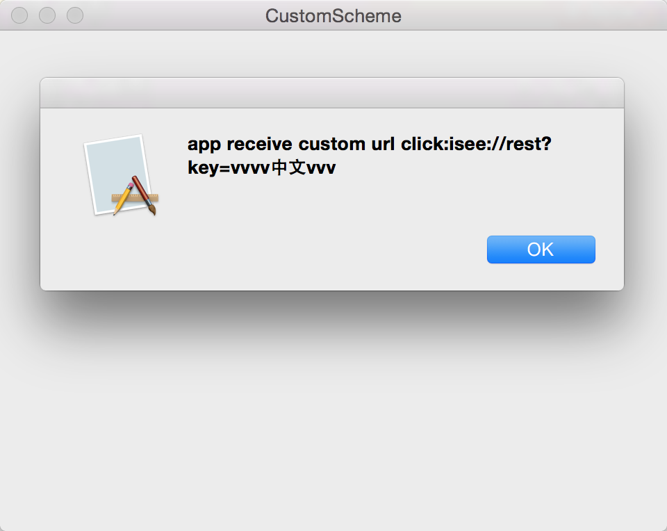

# Mac OSX custom url scheme
```
//Info.plist
<key>CFBundleURLTypes</key>
        <array>
            <dict>
                <key>CFBundleURLName</key>
                <string>cn.z.isee</string>
                <key>CFBundleURLSchemes</key>
                <array>
                    <string>isee</string>
                </array>
            </dict>
        </array>

```

```
- (void)applicationWillFinishLaunching:(NSNotification *)aNotification
{
    // Register ourselves as a URL handler for this URL
    [[NSAppleEventManager sharedAppleEventManager] setEventHandler:self andSelector:@selector(handleURLEvent:withReplyEvent:) forEventClass:kInternetEventClass andEventID:kAEGetURL];
}

- (void)handleURLEvent:(NSAppleEventDescriptor *)theEvent withReplyEvent:(NSAppleEventDescriptor *)replyEvent
{
    NSString *path = [[[theEvent paramDescriptorForKeyword:keyDirectObject] stringValue] stringByReplacingPercentEscapesUsingEncoding:NSUTF8StringEncoding];
    NSAlert *alert = [[NSAlert alloc] init];
    [alert setMessageText:[NSString stringWithFormat:@"app receive custom url click:%@", path]];
    [alert addButtonWithTitle:@"OK"];
    [alert runModal];
}

```
<br>
</img>
</img>
